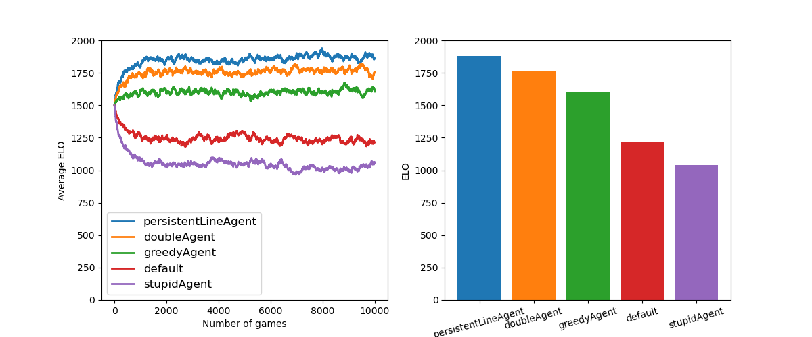

# Documentation: Multiplayer ELO

Evaluating an agent's policy requires a method of comparing the skill level
and win probability of each agent in comparison with the other agents. A good
choice for this problem is ELO ratings, which are used to determine the 
probability one agent will win against another agent given their ELO ratings. 

The ELO rating system was developed for head-to-head zero-sum matchups (like 
in Chess); however, I am using a multiplayer variant suggested by
[Tom Kerrigan](http://www.tckerrigan.com/Misc/Multiplayer_Elo/). In short,
multiplayer ELO works by treating a match of N agents as N-1 head-to-head
matches, in which ELO is updated for each pair of agents with neighboring 
scores as if the game was only between those two agents. For example, suppose
three agents were playing dominoes and had scores of 0, 10, and 15. Then, 
we assume that agent 0 beat agent 1, and assume that agent 1 beat agent 2. 
Therefore, agents 0 and 2 receive one ELO update, and agent 1 receives two 
updates.

## ELO Updates
ELO updates are coded in the [`leagueManager`](../dominoes/leagueManager.py)
module. The league manager has a "league" of N agents, of which M of them play
games against each other (M<=N). After each game, the game results and the 
league index of each agent are fed back to the league manager to update the 
ELO scores of those agents. 

First, the expected score for each agent pair in the game is measured, where 
agent score is equal to the probability of winning (not the dominoe score). 
Then, ELO scores are updated based on the true winner and a "k" parameter, 
which is set by the league manager and determines how much an agents ELO can 
change for any particular game. The baseline ELO is set to 1500, which is an 
arbitrary choice, and can be changed to whatever range of values you are most
comfortable with. The specific equations used for ELO are coded in the 
[`functions`](../dominoes/functions.py) module, named `eloExpected` and 
`eloUpdate`. 

## Measuring ELO of basic agents
To test the multiplayer ELO system and evaluate the policies of basic 
hand-crafted agents, I wrote a script called 
[`basicAgentELOs`](../experiments/basicAgentELOs.py) that creates a league of
basic agents and plays many games between agents, updating their ELO ratings 
until they stabilize. 

From the top-level directory of this repository, you can run this experiment
on your own computer with the following command:
```
python experiments/basicAgentELOs.py
```
The script has several optional input arguments that determine the parameters
of the league and meta-parameters for the experiment (e.g. how many games to 
play for estimating ELO). 

The main result of the experiment is shown here:


To summarize, ELO ratings stablize quickly (after about 1000 games, which 
takes about 5 minutes of wall time on my computer), and indicate that the best
hand-crafted policy is that of the best-line agent, followed closely by the 
double agent. As expected, agents that play randomly or play dominoes with the 
lowest point value perform worse than other agents. 

