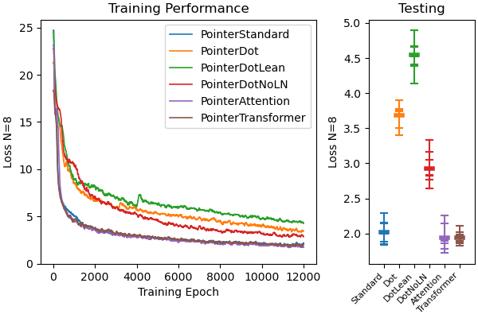
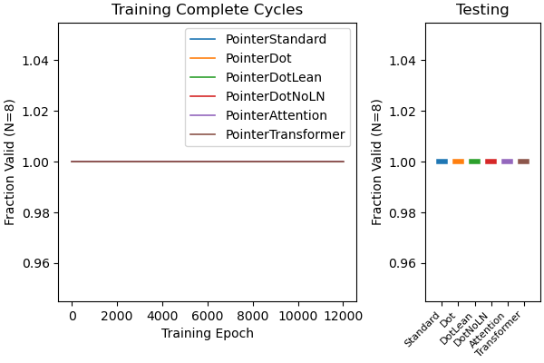

# Documentation: Traveling Salesman Problem

This documentation file shows how the new architectures for the pointer 
attention layer perform on the traveling salesman problem. I train the 
networks using both supervised learning and reinforcement learning (using the
REINFORCE algorithm). 

For more detail on the new architectures, go
[here](pointerArchitectureComparison.md).

To reproduce the plots in this file, you'll need to run two python scripts. As
before, I train 5 networks for each architecture type, so each of these 
scripts takes about 3-4 hours to run. For a faster test that trains only one
network per type, use the argument ``--num-runs 1``. 
```
python experiments/ptrArchComp_TSP_SL.py
python experiments/ptrArchComp_TSP_RL.py
```

## The Traveling Salesman Problem
The traveling salesman problem is a well-defined, highly-studied problem in 
which the goal is to find the shortest path through a list of cities that 
takes you to each city. Here's a schematic of what that looks like from the 
[wiki](https://en.wikipedia.org/wiki/Travelling_salesman_problem):

<p align="center">
  
</p>

I chose this problem because it is often used to test the performance of 
pointer networks, including in the first paper to introduce them (Vinyals et
al.). Why? Primarily because pointer networks have the interesting and useful
feature of being able to generate a sequential output with a variable length
dictionary, where in this case the pointer network needs to generate a 
sequence from a variable number of cities. 

As in the original paper, I generated a list of N (N=8) cities with 
coordinates inside the unit square $0 <= x,y < 1$.

#### Training with Supervised Learning 
To train networks on this problem with supervised learning, we need to first 
define the target. As in the original paper, I measured the optimal path with
the held-karp algorithm using an existing python implementation (thanks to 
[Carl Ekerot](https://github.com/CarlEkerot/held-karp/blob/master/held-karp.py)).
Then, to keep the target consistent, I shifted and reversed the path as 
required such that the first city visited was always closest to the origin, 
and such that the path traveled is always clockwise. 

#### Training with Reinforcement Learning
To train networks on this problem with reinforcement learning, we first need
to define a reward function. This problem has two challenges a network needs
to solve. First, it needs to travel to every city without revisiting any city.
Second, it needs to take the shortest possible path. These two features lead
to two independent reward functions. 

- I assign a reward of 1 for every new city that is reached and a reward
of -1 for every revisited city. 
- For every step taken with euclidean distance traveled $d$, I assign a reward
of $-d$ (because REINFORCE performs gradient ascent, and the goal is to 
minimize distance traveled). The first step has a reward of 0. 


## Results
There are three natural methods of measuring the performance on the supervised
learning formulation of the problem. (1) Of course, we can measure the loss 
(defined as the negative log-likelihood loss between the output and target). 
However, due to the nature of the problem, we can also measure: (2) the 
fraction of completed tours (e.g. how frequently the network accurately visits
every city) and (3) the average tour length of completed tours (e.g. the total
distance traveled). For the summary plots of the testing performance in the 
right panel, I show the average with a thick horizontal bar, the result for 
each network with a thin horizontal bar, and the range with the vertical bar. 

### Supervised Learning Results
Here's the loss:



The loss of the networks with standard pointer layers does well compared to
the dot-product based pointer layers. However, the pointer "attention" and 
pointer "transformer" layers do even better than the standard network. That
improvement in performance is reflected in the fraction of completed tours and
the average tour length for completed tours.


Here's the fraction of completed tours:


And here's the average tour length for completed tours:


As you can see, the attention and transformer based pointer layers 
consistently complete more tours and do so in a smaller distance. Overall, 
however, this result is in agreement with the supervised learning results on 
the [toy problem](pointerArchitectureComparison.md#variations-in-learning-algorithm-supervised-learning).
Generally, all the pointer layers have similar performance when trained with
supervised learning.

### Reinforcement Learning Results
For the reinforcement learning problem, we can measure the performance the 
same way, but without consideration of the loss (it's not defined since there
is no longer a "correct" way to solve the problem). 

Note that during training the networks choose with thompson sampling and a 
temperature of 5, so although the curves provide some information about the 
learning trajectory, it is much more informative to focus on the testing 
results. 

Here's the fraction of completed tours:



And here's the average tour length for completed tours:


In terms of both measures, almost all of the networks equipped with new 
pointer layer architectures perform better on the task! Given the variance in
performance, it would obviously be nice to train quite a few more networks, 
but overall it seems like the new architectures consistently learn via 
reinforcement learning more effectively than the standard pointer layer. 
This is in agreement with the results from the dominoes 
[toy problem](pointerArchitectureComparison.md#network-performance). 

### Measuring the "confidence" of the networks
We can also measure how confident the networks are in the solution. As before,
I measure confidence as the maximum score assigned to a city at each position
in the output sequence, which is defined as the networks choice (it's a 
probability). 

For supervised learning, we have this: 


And for reinforcement learning, we have this:


As expected based on the dominoes 
[toy problem](pointerArchitectureComparison.md#network-confidence) and the 
intuition that a network with better performance will be more "confident", 
there is a close correspondence between the confidence of the networks trained 
with both SL and RL and their respective performance. 

