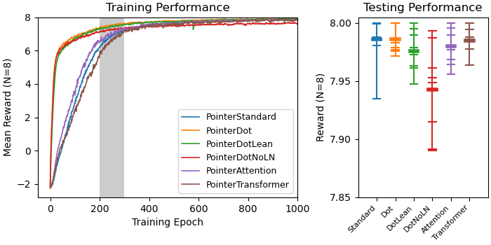
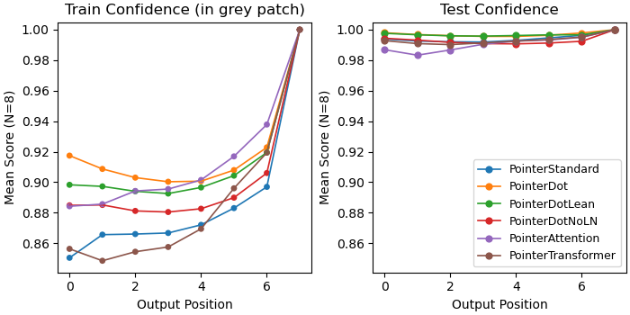
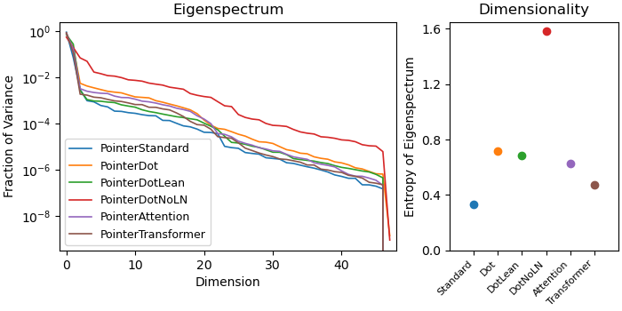

# Documentation: Pointer Network Architecture Comparison

This documentation file shows the results of an experiment in which I compare
different architectures for the pointer attention layer. I use the same toy 
problem as in [pointer demonstration](pointerDemonstration.md), but train the
networks with the REINFORCE algorithm rather than supervised learning. 

I'll start by explaining the reinforcement learning setup, then explain the 
different architectures of the pointer attention layer. After that, I'll show
the results and analysis of the networks performance and mechanisms of solving
the task. 

You can run this experiment yourself with the following command. The default
parameters will train 5 networks for each architecture, so this takes about an
hour on my computer. For a faster test, use the argument ``--num-runs 1``.
```
python experiments/pointerArchitectureComparison.py
```

## REINFORCE
The task is identical to the previous experiment in 
[pointer demonstration](pointerDemonstration.md), apart from one small 
detail. The network receives a representation of a set of dominoes, and has to
sort them with a pointer network by generating a sequence of indices to the 
dominoes in its "hand" from highest dominoe value to lowest. See the pointer
demonstration documentation for more explanation. 

In the demonstration, I used supervised learning to train the network. Here, I
use the REINFORCE algorithm. Briefly, the training process performs gradient 
ascent on a term called $J(\theta)$:

$$\large J(\theta) = \mathbb{E}[\sum_{t=0}^{T-1} r_{t+1} | \pi_\theta]$$

Where $J(\theta)$ represents the expected value of reward over the course of a
"rollout" from timesteps $t=0$ to $t=T-1$ given the policy $\pi_\theta$. The
gradient of $J(\theta)$ with respect to the policy is:

$$\large \nabla_{\theta}J(\theta) = \sum_{t=0}^{T-1} \nabla_{\theta} \log \pi_{\theta}(a_t | s_t)G_t $$

Where $G_t$ represents the net discounted reward from time $t$ into the 
future:

$$\large G_t = \sum_{t'=t+1}^{T-1} \gamma^{t'-t-1}r_{t'}$$

Note: thanks to the excellent Medium 
[article](https://medium.com/@thechrisyoon/deriving-policy-gradients-and-implementing-reinforce-f887949bd63) 
written by [Chris Yoon](https://medium.com/@thechrisyoon) for helping me learn
this. 

### Rewards
As in any reinforcement learning problem, the reward needs to be well-defined
and chosen well. For this task, I assign a reward of $1$ if the agent chooses 
a dominoe that (1) is less than or equal to the value of the previous dominoe 
and (2) if that dominoe has not been chosen yet. Otherwise, the reward is 
$-1$. This way, the agent maximizes total reward in a rollout by playing the 
dominoes in decreasing order of value. Note: unlike the supervised learning 
method, in which dominoes of equal value _have_ to be played in the same order 
each time, this RL setup affords flexibility and the order no longer matters 
for equal value dominoes. 

Since each rollout is finite (the number of dominoes the agents have to sort
for each batch element was always set to $8$), I chose a discounting factor of
$\gamma=1$. 

### Training
To train the network, I used the Adam optimizer with $lr=1e^{-3}$ and L2 
regularization with $\lambda=1e^{-5}$. The $J(\theta)$ term is flipped in sign
so the PyTorch gradient descent algorithm effectively performs gradient ascent
on this problem. 

Additionally, the networks were trained with Thompson sampling and 
$temperature=5$ to encourage exploration, but returned to a greedy policy with
$temperature=1$ for testing.

### Testing
Just like in the "demonstration" toy problem, training is done with held out
dominoes, which are replaced for testing. This checks generalization 
performance and confirms that the networks are really solving the intended 
problem and not just memorizing the training data. 

## New Pointer Attention Architectures
As far as I can tell, the only pointer attention layer that is ever used in 
the literature is the one introduced in 
[this paper](https://arxiv.org/pdf/1409.0473.pdf) and used in the original
[paper](https://papers.nips.cc/paper_files/paper/2015/file/29921001f2f04bd3baee84a12e98098f-Paper.pdf)
on pointer networks. Here, I introduce four new architectures (one of which
has three variants). I'll refer to them as the "pointer layer" throughout. 
For more detail, see the [code](../dominoes/transformers.py).

#### Inputs to Pointer Layer
Before the pass through the pointer layer, the full network generates three
tensors. First is the `encoded` tensor, containing the encoded representation
of each token in a batch. For example, if the batch size is 512, the maxmimum
number of tokens is 12, and the embedding dimension is 256, then the `encoded`
tensor will have shape `(512, 12, 256)`. Second is the `context` tensor, which
characterizes the entire set of tokens per batch element. There is a single 
`context` tensor per batch element with the same embedding dimension. Finally, 
there is an `output` tensor, which represents the last token chosen by the 
network. This can either be a weighted average of tokens or a greedy 
representation of whatever token was chosen. 

Let $e = \text{encoded}$, $c = \text{context}$, and $o = \text{output}$.

### Standard Pointer Layer -- [code](https://github.com/landoskape/dominoes/blob/main/dominoes/transformers.py#L368)
The standard pointer layer projects the `encoded` and `context` tensors to a
new space, adds them together (with broadcasting), then projects them onto an
"attention" vector after passing them through a hyperbolic tangent 
nonlinearity.

$$\large u_i = v^T \tanh (W_1 e_i + W_2 c)$$

### Pointer "Dot" Layer -- [code](https://github.com/landoskape/dominoes/blob/main/dominoes/transformers.py#L404)
The pointer dot layer also projects the `encoded` and `context` tensors to a 
new space, but then takes the dot product between each projected `encoded` 
vector and the projected `context` vector. This skips the tanh and projection
onto $v^T$. Because the nonlinearity is dropped, a `LayerNorm` is used on the
`encoded` and `context` representation before the dot product is taken. 

$$\large u_i = LN(W_1 e_i) \cdot LN(W_2 c) $$

### Pointer "Dot" Variant 1: Pointer Dot Lean -- [code](https://github.com/landoskape/dominoes/blob/main/dominoes/transformers.py#L480)
One variant of the pointer dot layer is called pointer dot lean. It is 
identical to the above pointer dot layer except it drops the $W_1$ and $W_2$
matrices. This essentially requires the encoder phase of the pointer network
to do all the work putting the `encoded` representations into a space that 
can be effectively "pointed" to by the `context` vector.

$$\large u_i = LN(e_i) \cdot LN(c) $$

### Pointer "Dot" Variant 2: Pointer Do No Layer Norm -- [code](https://github.com/landoskape/dominoes/blob/main/dominoes/transformers.py#L443)
The other variant is identical to the main pointer dot layer, but doesn't use
a layer norm. This is a bit noisy, but learns very fast, as you'll see in the
results. 

$$\large u_i = (W_1 e_i) \cdot (W_2 c) $$

### Pointer "Attention" Layer -- [code](https://github.com/landoskape/dominoes/blob/main/dominoes/transformers.py#L517)
The pointer attention layer uses a variant of self-attention that I call
"multi context attention" 
([code](https://github.com/landoskape/dominoes/blob/main/dominoes/transformers.py#L240)). 
This projects "main" inputs to queries, keys, and values using one set of 
matrices. It also projects "context" inputs to keys and values using a 
different set of matrices. Then, the main inputs are "attended to" using all
keys and values (from both main and context inputs). 

For this pointer layer, the main inputs are the `encoded` representations and
the context inputs are both the `context` representation and the `output` 
representation. This leads to a new attended representation of the `encoded` 
tokens, which is passed through a hyperbolic tangent and projected onto an 
"attention" vector $v^T$ just like in the standard pointer layer. 

### Pointer "Transformer" Layer -- [code](https://github.com/landoskape/dominoes/blob/main/dominoes/transformers.py#L549)
The pointer transformer layer is almost identical to the pointer attention
layer, except it uses multi context attention followed by the standard double
feedforward layer used in transformers. 


## Results
I trained 5 networks of each architecture and compared their performance on 
the task. Each curve is an average of the performance of all networks from
each type. The number of tokens per "hand" is always 8, which means the best 
the networks can do in each rollout is a total reward of 8. 


### Network Performance 
The main result of the problem is shown here: 


The left panel shows the average cumulative reward ($\sum_t r_t$) for each 
rollout across training. All networks learn to solve the task close to optimal
performance (i.e. close to an average cumulative reward of $8$). However, 
networks that use new variants of the pointer layer tend to learn faster. (The
standard pointer layer is in blue). The inset highlights the first 400 epochs 
to show the initial learning curves for each network in more detail. 

The right panel shows the testing performance, after returning held-out 
dominoes to the input data and averaging across 100 epochs for all 5 networks
of each architecture. All new architectures except for the "Dot No Layer Norm"
(DotNoLN) perform better than the standard pointer layer. Additionally, the 
variance in test performance is lower for the new architectures, especially 
for the two networks that use multi-context attention (PointerAttention and
PointerTransformer).

Note: the DotNoLN networks learn fastest, see the training inset, however, 
once they reach asymptotic performance, their behavior becomes very noisy. I
think this is because there is no dampening on the magnitude of values going
into the dot product, so the gradient might overflow. I haven't tested this 
yet. 

For results on the supervised learning task, see 
[this plot](media/sl_pointerArchitectureComparison.png) and 
[this plot](media/sl_pointerArchitectureComparison_confidence.png). More 
discussion on this will come later.

### Network Confidence
What might explain the weaker performance of the standard pointer layer? Since
the new architectures vary the mechanism by which each token is selected in an
output sequence, one difference might be the maximum probability assigned to a 
token in the generative phase. Since the maximum probability represents the 
choice of the network, I'll refer to this as the network confidence. 

To test this, I measured the average maximum probability in each output 
position for the networks during a window of the training phase and during
testing. 



The left panel shows the confidence during training -- this is averaged over
the epochs highlighted by the grey patch in the training/testing figure. The
right panel shows the confidence during the testing phase. (Note that I
corrected for the effect of temperature for the training data). 

As in the previous toy problem, the confidence is lowest for the middle parts
of the output sequence. This is partly due to the fact that many more dominoes
have intermediate values than extreme values (like the sum rolled on a pair of
dice), so it's a bit harder to sort in the middle. However, the standard 
pointer layer suffers most from this challenge, dropping in confidence by 
almost 10%, where the other pointer layers only drop by 3-4%. 

All networks improve their confidence over the course of training, reaching 
near 100% confidence by the testing phase. However, the standard pointer layer
still suffers from reductions in confidence for intermediate output positions 
during testing, clearly standing out from the rest of the pointer layer 
architectures. 

The standard pointer layer may approach equal levels of confidence if trained
for longer; however, given the cost of training and the much greater 
complexity of real-world problems, these new architectures may be beneficial
for getting the most out of a network with a limited time and money budget. 

### Network Representation of Input
I am in the process of doing a detailed analysis of (1) how these different 
networks represent their inputs and (2) the precise mechanism of generating
scores for each token during the generative phase. As a first pass, I did a 
simple analysis where I measured the eigenspectrum of the `encoded` 
representations for each network architecture. 

To measure the eigenspectrum, I generated an input batch with 1024 batch 
elements (still using 8 tokens per batch element). Then, I processed it 
through the encoder phase of each pointer network, and measured the 
eigenvalues of the covariance matrix across the embedding dimension. Note that
the encoding architecture is identical across the different networks and the 
`encoded` representations do not depend on the pointer layer. Therefore, the 
only reason this will differ across pointer layer types is because of the 
structure of the gradients passing through the pointer layers during training.

As a measure of dimensionality, I use the shannon entropy of the normalized
eigenvalues, which is highest if each embedding dimension is used equally. 



The left panel shows the normalized eigenspectra for each network. Note that
the y-axis is on a log-scale. As (I think) is expected, the first few 
dimensions carry most of the variance, and there is a log-linear dropoff in 
variance afterwards. The right panel shows the dimensionality of each network
type (as measured by shannon entropy).

The new architectures that perform better than the standard pointer layer have
a higher dimensionality in the `encoded` representations. Although it is not 
directly correlated with performance, this result could hint at how or why the
new architectures perform this task more effectively. 


