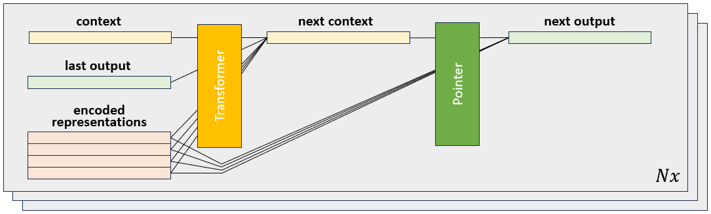
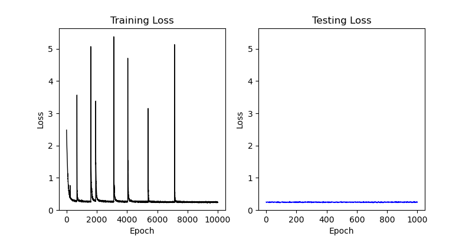

# Documentation: Transformer and Pointer Network Demonstration

The most sophisticated agents use transformers to encode the set of dominoes
in their hand. I plan on using pointer networks as a method of pretraining
these dominoes agents (not coded yet, because I want to solve how to train
pointer networks to sequence lines with reinforcement learning first!). This
documentation file shows how the transformers and pointer networks work, and
displays the results of a simple toy problem solved by pointer networks. 

## Toy Problem
The toy problem is written as an experiment called 
[pointerDemonstration](../experiments/pointerDemonstration.py). It trains a
pointer network to sort dominoes by the value on each dominoe given a random
set of dominoes in random order. Due to the magic (engineering) of pointer 
networks, it can do this on input data with a variable set size. Since it's a
simple problem, the pointer network learns the task in just a few minutes. 

You can run this toy problem yourself with the following command:
```
python experiments/pointerDemonstration.py
```

### Input
A full set of dominoes is a set of paired values (combinations with 
replacement) of the integers from 0 to `highestDominoe`. Therefore, the input
to the network is represented as a two-hot tensor stack in which each '1' in 
the tensor represents the values on the dominoe. 

The first `highestDominoe+1` elements represent the first value of the dominoe
and the second `highestDominoe+1` elements represent the second value of the
dominoe. Here are some examples for `highestDominoe = 3`:

(0 | 0): `[1, 0, 0, 0, 1, 0, 0, 0]`  
(0 | 1): `[1, 0, 0, 0, 0, 1, 0, 0]`  
(0 | 2): `[1, 0, 0, 0, 0, 0, 1, 0]`  
(0 | 3): `[1, 0, 0, 0, 0, 0, 0, 1]`  
(1 | 0): `[0, 1, 0, 0, 1, 0, 0, 0]`  
(2 | 1): `[0, 0, 1, 0, 0, 1, 0, 0]`  

### Target
The value of each dominoe is the sum of the two values on the dominoe. For 
example, the dominoe `(1 | 2)` has value `3`. The task of this toy problem is 
to sort dominoes based on their value, from highest to lowest, and output them
in order using a pointer network. Note that some dominoes have equal value in 
a set, but because the dominoes are always initialized in the same order, 
equal value dominoes are always sorted in the same way. 

The target is represented as a list of integers corresponding to the arg sort
of the dominoe values for each hand. As an example, if a hand was composed of 
the 6 dominoes shown above as an example, the target is `[5,3,2,4,1,0]`.

### Network Architecture
The pointer network architecture consists of two stages, an encoder and a 
decoder. The encoder generates an embedding of each element of an input 
sequence, along with a context vector that describes the state of the whole
set of inputs. The decoder first updates the context vector based on the last 
output of the network. Second, it chooses one of the input elements to output 
next by combining the embedded representations with the context vector.

In the original paper by Vinyals et al., the encoder is an LSTM RNN. In this
implementation, I have replaced the LSTM with a transfomer. Then, the context
vector is just a sum of the transformed input representations. 


The decoder stage first updates the context vector. In the original paper, 
this is performed with a second RNN in which the context vector is 
equivalent to the hidden state (or cell state, depending on which RNN is 
used). Here, I replace it with a "contextual transformer", in which the 
transformer receives some inputs to be transformed and some inputs that are 
purely used for context. Those "context inputs" are used to generate keys and
value but not queries, and so are not transformed. Finally, a pointer 
attention module combines the new context vector with the encoded 
representations to choose one of the inputs as the next output. This is done
however many times is requested. 



### Training
To train the network, I used the Adam optimizer with $lr=1e^{-3}$ and L2 
regularization with $\lambda=1e^{-5}$.

## Results

The main result of the problem is shown here: 


As you can see, the network quickly learns to sort dominoes by their value 
effectively. Pretty cool! (As an aside, I think it's pretty awesome that each
batch has data with uneven sequence lengths, and the network can handle that 
kind of input.)


<!---The third panel of the figure shows that the lost 
depends on the sequence size, which makes sense because there is more room 
for error and uncertainty in a longer list of dominoes to sort, and the 
negative log-likelihood loss function penalizes the network for uncertainty. ---!>


