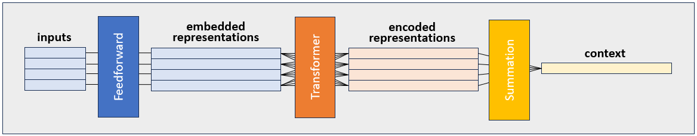

# Documentation: Transformer and Pointer Network Demonstration

The most sophisticated agents use transformers to encode the set of dominoes
in their hand. I plan on using pointer networks as a method of pretraining
these dominoes agents (not coded yet, because I want to solve how to train
pointer networks to sequence lines with reinforcement learning first!). This
documentation file shows how the transformers and pointer networks work, and
displays the results of a simple toy problem solved by pointer networks. 

You can run this toy problem yourself with the following command, this takes
about 5 minutes on my GPU equipped machine:
```
python experiments/pointerDemonstration.py
```

## Toy Problem Explanation
The toy problem is written as an experiment called 
[pointerDemonstration](../experiments/pointerDemonstration.py). It trains a
pointer network to sort dominoes by the value on each dominoe given a random
set of dominoes in random order. Due to the magic (engineering) of pointer 
networks, it can do this on input data with a variable set size. Since it's a
simple problem, the pointer network learns the task in just a few minutes. 

As a means of testing whether the network really learns the values of dominoes
rather than just a lookup table of inputs to outputs, the training set 
includes only 2/3rds of the possible dominoe representations but the testing
is done with all of them. 


### Input
A full set of dominoes is a set of paired values (combinations with 
replacement) of the integers from 0 to `highestDominoe`. Therefore, the input
to the network is represented as a two-hot tensor stack in which each '1' in 
the tensor represents the values on the dominoe. 

The first `highestDominoe+1` elements represent the first value of the dominoe
and the second `highestDominoe+1` elements represent the second value of the
dominoe. Here are some examples for `highestDominoe = 3`:

(0 | 0): `[1, 0, 0, 0, 1, 0, 0, 0]`  
(0 | 1): `[1, 0, 0, 0, 0, 1, 0, 0]`  
(0 | 2): `[1, 0, 0, 0, 0, 0, 1, 0]`  
(0 | 3): `[1, 0, 0, 0, 0, 0, 0, 1]`  
(1 | 0): `[0, 1, 0, 0, 1, 0, 0, 0]`  
(2 | 1): `[0, 0, 1, 0, 0, 1, 0, 0]`  

Dominoes with non-equal value pairs (e.g. `(1 | 2)`) are represented in the 
dataset in both directions (it includes the `(2 | 1)`) representation.

### Target
The value of each dominoe is the sum of the two values on the dominoe. For 
example, the dominoe `(1 | 2)` has value `3`. The task of this toy problem is 
to sort dominoes based on their value, from highest to lowest, and output them
in order using a pointer network. Note that some dominoes have equal value in 
a set, but because the dominoes are always initialized in the same order, 
equal value dominoes are always sorted in the same way. 

The target is represented as a list of integers corresponding to the arg sort
of the dominoe values for each hand. As an example, if a hand was composed of 
the 6 dominoes shown above as an example, the target is `[5,3,2,4,1,0]`.

### Network Architecture
The pointer network architecture consists of two stages, an encoder and a 
decoder. The encoder generates an embedding of each element of an input 
sequence, along with a context vector that describes the state of the whole
set of inputs. The decoder first updates the context vector based on the last 
output of the network. Second, it chooses one of the input elements to output 
next by combining the embedded representations with the context vector.

In the original paper by Vinyals et al., the encoder is an LSTM RNN. In this
implementation, I have replaced the LSTM with a transfomer. Then, the context
vector is just a sum of the transformed input representations. 



The decoder stage first updates the context vector. In the original paper, 
this is performed with a second RNN in which the context vector is 
equivalent to the hidden state (or cell state, depending on which RNN is 
used). Here, I replace it with a "contextual transformer", in which the 
transformer receives some inputs to be transformed and some inputs that are 
purely used for context. Those "context inputs" are used to generate keys and
value but not queries, and so are not transformed. Finally, a pointer 
attention module combines the new context vector with the encoded 
representations to choose one of the inputs as the next output. This is done
however many times is requested. 


### Training
To train the network, I used the Adam optimizer with $lr=1e^{-3}$ and L2 
regularization with $\lambda=1e^{-5}$.

### Testing
Testing is exactly the same as training, except the remaining 1/3 of dominoe
pairs are returned to the dataset. 

## Results

The main result of the problem is shown here: 


As you can see, the network quickly learns to sort dominoes by their value 
effectively. Pretty cool! There are two key observations to make that I'd like
to discuss: the lack of an increase in loss for the testing phase and the loss
spikes during the training phase. 

### Test loss is similar to final training loss
The testing loss is essentially identical to the final training loss. This is 
despite the fact that the network is all of a sudden seeing new dominoes 
during the testing phase (see above for explanation of the hold out 
procedure). What this means is that the network doesn't simply learn a look up
table between input and output. Instead it really learns exactly what the 
task is: sort dominoes based on the sum of their value.

### Loss spikes during training
During the training phase, there are some pretty large spikes in the loss. 
What is going on? To understand why those loss spikes occur, take a look at 
the following figure. It shows a few loss-spikes in the top panel (as 
identified by scipy's find-peaks method), with the loss-spike triggered 
average of the error as a function of output sequence position in the bottom
panel.


The error is defined as the average difference in the max score and the target
score for each position. (The score is the log-probability for each option, 
and the max score is the one that the model "chose" for each step based on its
greedy policy).

Right before the loss spike, there is a small increase in error for the middle
positions (purple to brown on the colormap). These same positions are the ones
that spike in error when the loss gets very high. Interestingly, the early and
late positions are somewhat immune from this spike in error. Why would this
be?

In this next figure, I'm plotting the "confidence" (e.g. the max probability) 
of each choice as a function of sequence position. As before, it's a
loss-spike triggered average of the same epochs. On the right is the baseline
confidence for each position. 


What this indicates is that the network is less confident about later output
positions, and least confident about the middle positions. I conclude two
things from this:

- The pointer network architecture may accumulate uncertainty if it is trained
  on problems that require it to produce long output sequences. Alternatively,
  the pointer network might _specifically be bad_ at producing a high
  confidence "point" towards intermediary positions in a sequence.
- Additionally, in this particular problem, the middle choices are harder,
  because some dominoes have the same value but have to be sorted in a certain
  order. See the [target](###Target) section above for more explanation.

These two points probably explain how the loss spikes occur -- sometimes the
network is tasked with sorting a particularly challenging set of dominoes. 
When that happens, the networks architectural challenges lead it to get the 
output very wrong, such that a huge misleading error backpropagates through
and confuses it for the next few epochs. Interesting! Maybe there's a way to 
teach a pointer network how to filter error based on whether it's likely to be
due to these shift-based failure modes. 

Also interesting: the return to good performance is much faster after one of 
these spikes than it would be at a similar training loss after initialization.
Curious. I wonder why that's happening. 


